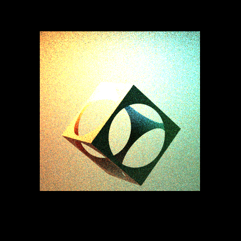
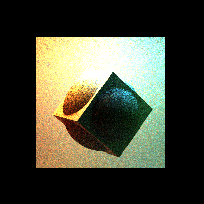
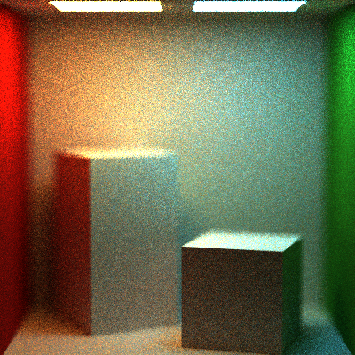
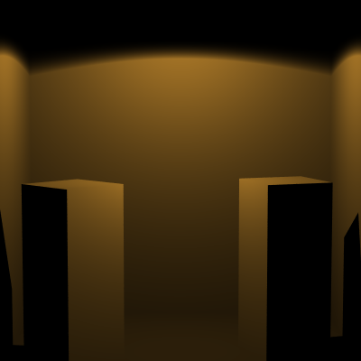
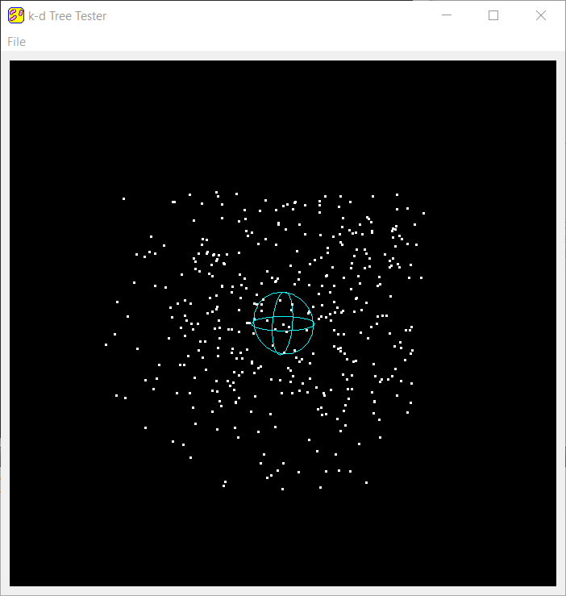
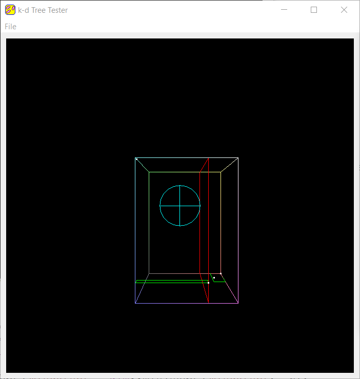
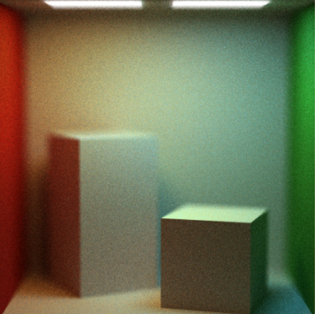
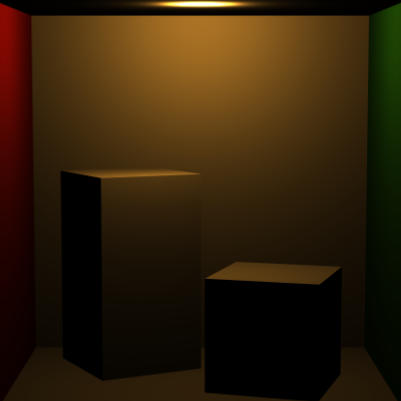
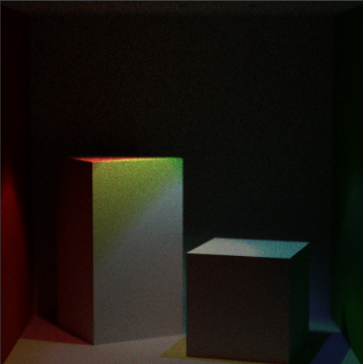

Making a k-d Tree
======================

**University of Pennsylvania, CIS 561: Advanced Computer Graphics, Homework 8**
------------
CSG Renders

  

Thin Lens Render

Point Light Render

Spot Light Render

Overview
------------
You will implement a k-d tree in a standalone application. Your tree will store
point data and will be used to find all points within a certain radius of some
other point. We want you to have practice building an acceleration data structure,
and you may even use this in a branch of the final project: building a photon mapper.

You will also add more features to your path tracer to be able to render more
complex scenes, such as a more physically-based camera and a new method of
representing shapes.

Provided code
------
We have provided a __standalone application__ in which to build your k-d tree.
The k-d tree code is set up to display a collection of points and a sphere
representing a search radius.

Once you have implemented your k-d tree construction you will be able to
visualize it as well.

Useful Reading
---------
The following PBRT chapters are relevant to the features listed for this
assignment:
* Chapter 6.4: Realistic Cameras
* Chapter 12: Light Sources

Building your k-d tree (30 points)
-----------
In `kdtree.cpp`, fill in the body of the `build` function. This function should
assign values to the `minCorner` and `maxCorner` members of your `KDTree` and
should initialize its `root` member variable. It should also populate `root`'s
children (and their children and so on) using a separate recursive function.
This function's base case should be when a node would be assigned 0 or 1 points
to store, in which case that node should have its `particles` variable assigned
and the function should return. This does mean that only leaf nodes will contain
points, and will contain at most only one point.

Make sure that as you build your k-d tree, you set each node's min and max
boundary attributes, which are necessary for your tree to be properly visualized. You should also tell each node which axis it was split on;
0 means X-axis, 1 means Y-axis, and 2 means Z-axis.

You can test your tree's construction visually by checking the "Display k-d Tree"
box in the GUI (it's checked by default). However, if you try to visualize too
large of a k-d tree (e.g. one containing even as few as 1000 points) you will
likely crash the program as your GPU may not be able to handle all that floating
point data. A k-d tree that large would be too difficult to visually parse
anyway; we recommend visually testing on very small quantities of points (e.g.
4).

k-d Tree Intersection Functions (20 points)
-------
Implement `KDTree::particlesInSphere`, which should construct and return a
`std::vector` containing all the points that fall within the sphere defined by
center point `c` and radius `r`. You should implement functions within the
`KDNode` class to facilitate your search for these points, such as a function to
determine if a sphere overlaps this `KDNode` and if the point(s) contained by
the `KDNode` fall within the sphere.

You can test your implementation by pressing the "Search Points" button,
which will invoke `particlesInSphere` and highlight the points returned in
blue. Make sure your k-d tree has been constructed, otherwise the search will
not be invoked.

Other testing
---------
Once you've completed both halves of the k-d tree, you should test your
tree construction and point search on large sets of points (on the magnitude
of millions). Construction of a k-d tree on a set of one million points, for
example, should take at most around the order of 10-20 seconds, depending on
your hardware. We've enabled the points that fall within a radius to draw on top
of other points regardless of depth, so you should be able to see what looks
like a solid-ish blue sphere made of points if you radius-test a set of one
million points.

__Remember to disable the visualization of your k-d tree when building it on
large sets of points, or your program will crash!__

Thin-Lens Camera (15 points)
-------------------
Implement the thin-lens camera model as described in chapter 6.2.3 of PBRT.
You may wish to make this class inherit from the base `Camera` class we have
provided. You will also have to alter the `Scene` class to include an instance
of this new camera type. Render at least one scene with this new camera in
order to exhibit its depth-of-field effect. Here is an example render of
the two-lights Cornell Box scene with a focal length of 29.5 and lens radius
of 1.5:

Constructive Solid Geometry (20 points)
--------------------
Create a data structure, e.g. a binary
tree, that can be used to combine different geometries using the three basic
CSG operations: union, difference, and intersection. You will have to write an
`Intersect` function for this data structure, and would be best served to make
it inherit from the `Primitive` class. Your data structure does not need to
handle materials or light sources; these may be properties of the `Primitives`
contained _within_ the data structure.

We will leave the demonstration of your CSG up to you, rather than providing
test renders. Make sure you showcase the three different operations.

Other light Sources (15 points)
--------------------
Implement two of the light sources described in Chapter 12 of PBRT: `PointLight`
and `SpotLight`. If you choose to implement additional light types from the ones
described, each one will be worth 10 extra credit points.

Basic Cornell Box scene with a point light rather than area light:

Two-light Cornell Box scene with spot lights rather than area lights:

Submitting your project
--------------
Along with your project code, make sure that you fill out this `README.md` file
with your name and PennKey.

Submit both the k-d tree code and your path tracer code in your Git repository;
they should be stored in separate folders in the root directory of your repository.
